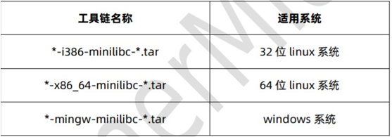
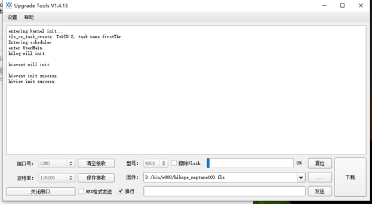
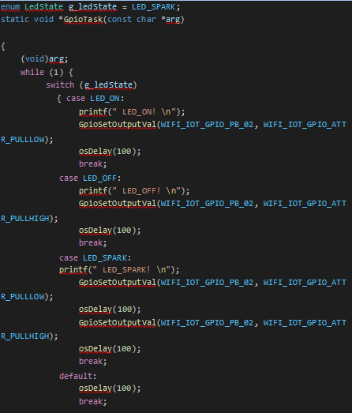
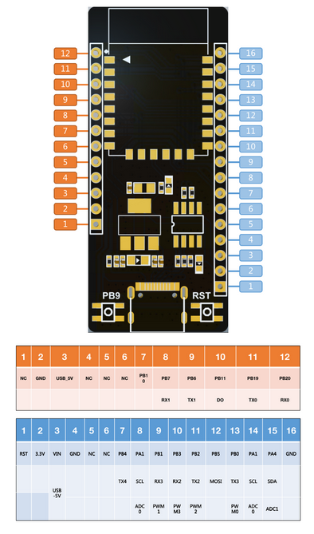
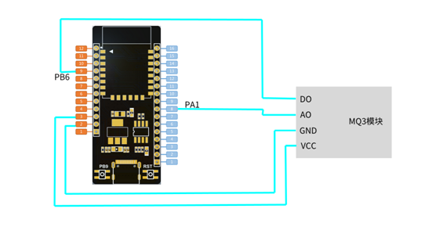

# 四博智联W800开发套件鸿蒙系统教程

（文档版本：V1.0 软件版本：V 1.0 硬件版本：V 1.0）

---

[TOC]

## 一. w800 开发套件及鸿蒙系统介绍
---

### 1.1 开发板硬件资料分配
源码下载：链接: https://pan.baidu.com/s/1q2asbei_QsZs867eSIVxfw 
提取码: z53u

w800 的 IO 口和外接设备的连接关系，其中外接设备包括：显示屏、按键、RGB 彩 灯、温度传感器、光敏传感器、USB 串口。通过板上的拨码开关可以控制板上不可插拔的 设备，板上不可插拔的设备是指：彩灯、温度传感器、光敏传感器和 USB 口。

### 1.2 供电
开发板可以通过 USB 接口。板上集成有 AMS1117-3.3V 稳压芯片，把输入的 5V 电压 稳压到 3.3V， 用于给板上的设备和模块都是供电。

### 1.3 USB 接口
USB 接口有三种功能：
* 供电：只要插上 USB 线到 USB 接口即可。
* 下载：USB 下载会有单独的一节说明。
* 串口调试：串口调试在实验中有说明。

注：当使用 USB 接口进行调试或者程序下载的时候，拨码 开关 5 和 6 必须打开。
### 1.4 按键
开发板一个复位键用于复位 W800     系统。点击下载软件复位后会进入下载模式。

### 1.5 RGB 彩灯
W800 的底板上集成了一个共阳极的彩灯，彩灯的阴极通过拨码开关后连接到 w800 的 IO 口(PB2、 PB7 和 PB11)，控制 IO 口为低电平时，对应的灯会亮起来。要使用彩灯，必须 打开拨码开关的 234。

### 1.6 DS18B20 温度传感器
W800 的底板上集成有一个 DS18B20 温度传感器，通过拨码开关后连接到 W800 的 PB3 口，W800 通过 PB3 可以读出当前的温度。要使用 DS18B20 传感器，须打开拨码开关的1。

### 1.7 显示屏接口
开发板支持两种显示屏：1.44 寸 TFT 彩屏、0.96 寸 OLED 屏。 这 2 种显示屏都是 4 线 SPI 接口。注：底板上显示屏接口边上都有丝印，插显示屏的时候，一定要注意显示屏方向 要正确，电源标志要  对应上，否则会烧坏显示屏。

### 1.8 光敏传感器
W800 通过光敏传感器可以采集环境光线的强弱，W800 的 PA1 通过拨码开关后连接到光 敏传感器 上，W800 使用 ADC 功能可以读取当前光线的强弱。要使用光敏传感器功能，必 须打开拨码开关的 7。

### 1.9 w800 鸿蒙系统介绍
HarmonyOS 是一款“面向未来”、面向全场景（移动办公、运动健康、社交通信、媒 体娱乐等）的分布式操作系统。在传统的单设备系统能力的基础上，HarmonyOS 提出了基于同一套系统能力、适配多种终端形态的分布式理念，能够支持多种终端设备。

对消费者而言，HarmonyOS 能够将生活场景中的各类终端进行能力整合，可以实现不 同的终端设备之间的快速连接、能力互助、资源共享，匹配合适的设备、提供流畅的全场 景体验。对应用开发者而言，HarmonyOS 采用了多种分布式技术，使得应用程序的开发实现与 不同终端设备的形态差异无关。这能够让开发者聚焦上层业务逻辑，更加便捷、高效地开 发应用。对设备开发者而言，HarmonyOS 采用了组件化的设计方案，可以根据设备的资源能力 和业务特征进行灵活裁剪，满足不同形态的终端设备对于操作系统的要求。

HarmonyOS 提供了支持多种开发语言的 API，供开发者进行应用开发。支持的开发语言 包括 Java、XML（Extensible Markup Language）、C/C++ 、 JS（JavaScript）、CSS
（Cascading Style Sheets）和 HML（HarmonyOS Markup Language）。

HarmonyOS 整体遵从分层设计，从下向上依次为：内核层、系统服务层、框架层和应 用层。系统功能按照“系统 > 子系统 > 功能/模块”逐级展开，在多设备部署场景下，支 持根据实际需求裁剪某些非必要的子系统或功能/模块。HarmonyOS 技术架构如下所示。


HarmonyOS 官网：https://device.harmonyos.com/cn/home 技术特性：硬件互助，资源共享一次开发，多端部署统一 OS，弹性部署

HarmonyOS 提供了用户程序框架、Ability 框架以及 UI 框架，支持应用开发过程中多 终端的业务逻辑和界面逻辑进行复用，能够实现应用的一次开发、多端部署，提升了跨设 备应用的开发效率。

HarmonyOS 通过组件化和小型化等设计方法，支持多种终端设备按需弹性部署，能够 适配不同类别的硬件资源和功能需求。支撑通过编译链关系去自动生成组件化的依赖关 系，形成组件树依赖图，支撑产品系统的便捷开发，降低硬件设备的开发门槛。

在搭载 HarmonyOS 的分布式终端上，可以保证“正确的人，通过正确的设备，正确地使用数据”。通过“分布式多端协同身份认证”来保证“正确的人”。 通过“在分布式终端上构筑可信运行环境”来保证“正确的设备”。 通过“分布式数据在跨终端流动的过程中，对数据进行分类分级管理”来保证“正确地使用数据”。

在官网获取源码后，源码目录说明：


### 1.10 OpenHarmony与HarmonyOS的关系
HarmonyOS 是华为独立研发的移动操作系统，它包括 HarmonyOS 的内核 +HMS（相当于谷歌的 GMS 服务）+AOSP，经简单二次开发后就可在移动终端上直接使用，华为拥有 HarmonyOS 的所有权和使用权。

而华为把不含 HMS 和 AOSP 的 HarmonyOS 底层内核捐赠给了开放原子开源基金会，由开放原子开源基金会孵化运营的就是 OpenHarmony，它的所有权属于开源社区，而不是华为。当然，华为也是开放原子开源基金会的重要成员之一。同时，由于是开源项目，任何人都可以下载使用 OpenHarmony，也可以贡献代码。

从逻辑关系上看，HarmonyOS 也可以理解为华为在 OpenHarmony 的基础上，融入了 HMS 和 AOSP 后的一个商业发行版。

总的来说，两者都是扩大 OpenHarmony 生态的重要组成。对于物联网来说，新的交互方式、新形态的硬件还处在最初的发展阶段。最为形象的表述就是物联网至今仍呈碎片化，一言蔽之就是所有的操作系统还不能用一套“语言”来讲述事情，不能联动、不能统一操作系统，那就很难协同联动，建立物联网时代的秩序就几乎等于纸上谈兵。OpenHarmony的伟大之处在于从架构开始，就把庞大的系统做了全线的拆解，让平板、手机、智能家居都可以通过建房子搭积木的方式来使用鸿蒙系统。这样一来，可穿戴设备和手机、平板和车机都可以实现万物互联。

### 1.11 OpenHarmony内核结构简介
OpenHarmony系统支持多种内核包括：
* 标准Linux内核
* Liteos_a
* Liteos_m

这里讲解主要是讲Liteos_m这个面向物联网单片机使用的轻量级内核。在OpenHarmony源码中的目录：kernel/liteos_m/kernel/src/，内核主要包含下面文件：


### 1.12 OpenHarmony内核调度器的启动
润和软件已经做了板级支持（BSP），并且芯片厂也给出了内核移植的汇编级别的代码。在OpenHarmony根目录的kernel/liteos_m/arch/csky/v2/gcc/，这个目录下给出了liteos内核启动和内核调度任务上下文切换的汇编代码，以及平台相关的底层C代码。

这里讲解内核启动的基本流程：
芯片上电后通过中断向量跳转进入wm_main.c的main函数执行，main函数中调用tls_os_init进行内核初始化；

从而进入los_init.c中定义的LOS_Start，进入ArchStartSchedule中执行OsSchedStart从任务队列取出第一个符合运行条件的任务，进入HalStartToRun执行任务上下文恢复操作，这是一个汇编级别的函数，进入中断状态，如下所示:

```
	HalStartToRun:
    lrw    r1, g_losTask
    lrw    r2, g_losTask + 4 //获得g_losTask对象的首地址
    ldw    r0, (r2) //
    st.w   r0, (r1)
    st.w   r0, (r2)
    ldw    sp, (r0)
    ldw    r0, (sp, 128)
    mtcr   r0, epc //加载PC指针
    ldw    r0, (sp, 124)
    mtcr   r0, epsr //加载psr状态寄存器
    ldw    r15, (sp, 56)
    ldm    r0-r13, (sp) //加载（恢复）r0~r13这14个寄存器值
    addi     sp, 60
    ldm      r16-r31, (sp) //加载（恢复）r16~r31这16个寄存器值
    addi     sp, 72
    Rte //中断返回就跳转到第一个任务中执行
```

该函数装载第一个任务，恢复其初始数据到各个硬件寄存器，中断返回后就进入第一个任务的任务体中执行相关操作，第一个任务其实就是进入到w800中main.c文件里定义UserMain函数里，这个函数属于应用层的主函数，它也是运行在一个任务中的。我们的应用层相关操作就可以直接在UserMain里面初始化并执行。

## 二. 开发环境搭建
这一章的内容是驱动的安装和软件开发环境的搭建。

### 2.1 串口驱动的安装
我们的开发板使用了 CH340G 的 USB 转串口芯片。通过 USB 线把开发板接到电脑上： 接着查看电脑的设备管理器，如下图表示驱动已经正确安装，可以跳过这一节：


如下图，表示要安装驱动


安装驱动步骤一:CH340 串口驱动位置：.\开发软件\USB-SERIAL CH340 Driver.rar，解压后如下：


安装驱动步骤二:把开发板通过 USB 线接到电脑上（要打开开发板电源），提示安装驱动如下：


安装驱动步骤三:打开电脑的设备管理器，查看串口的驱动是否已自动安装，如下图是未 安装的。


安装驱动步骤四:右键更新驱动，如下图


安装驱动步骤五:选择第一步解压好的目录：


安装驱动步骤六:选择确定后，有可能会出现以下的提示，选择“始终安装此驱动程序软件”。


安装驱动步骤七:安装完成后，设备管理器，如下图：


串口驱动程序安装好之后，关于串口程序下载和调试，后面会陆续讲解。

### 2.2 w800 Linux 开发环境搭建
推荐使用 Ubuntu 18.04。从官网 https://occ.t-head.cn 平头哥芯片开

放社区->技术部落->资源下载->工具，根据自己本地系统环境选择下载适用
的“800 Series Toolchain”。



下载后将编译工具链解压到的某个路径下（如 opt 目录），设置编译 工具链路径至环境变量，举例如下：

`export PATH=$PATH:/opt/ csky-elfabiv2-tools/bin`

上述设置完成，编译工具链即可用，可以进行接下来的编译工作。 用户也可将工具链的路径配置写至.profile 等配置文件中达到自动配置的目的,用户还可以在 sdk 中直接指定工具链路径。

### 2.3 w800 鸿蒙系统环境搭建
安装 gn、ninja
```
wget https://repo.huaweicloud.com/harmonyos/compiler/gn/1523/linux/gn.1523.tar
wget https://repo.huaweicloud.com/harmonyos/compiler/ninja/1.9.0/linux/ninja.1.9.0.tar

tar -xvf gn.1523.tar -C ~/
tar -xvf ninja.1.9.0.tar -C ~/ sudo vim ~/.bashrc
export PATH=~/gn:$PATH

export PATH=~/ninja:$PATH source ~/.bashrc
```

进入代码 hhi_d801_v1.0 根目录，编译命令：`python build.py w800`


完成编译链接后，w800 固件会生成，固件位于 out/w800/ 目录下，生 成文件有：
* w800.fls：串口烧录
* w800_ota.img：OTA 升级
* w800.map：map 文件

接下来介绍如何把固件烧录到 w800 开发板，以Windows 环境的烧录为 例：打开软件目录 ThingsTurn_Serial_Tool_V1.8.0.0，双击 ThingsTurn_Serial_Tool.exe。


打开串口，波特率 115200，选择固件文件 w800.fls 后点击下载，然后
按一下开发板的复位键开始下载。下载完成后复位板子运行程序。


鸿蒙系统启动：


### 2.4 OpenHarmony开发环境搭建
下载OpenHarmony源码，这里介绍从Gitee下载，前提条件：
1. 注册码云gitee帐号
2. 注册码云SSH公钥，请参考码云官方介绍：https://gitee.com/help/articles/4191
3. 安装git客户端和git-lfs并配置用户信息：

```
git config --global user.name "yourname"
git config --global user.email "your-email-address"
git config --global credential.helper store

```

5. 安装码云repo工具，可以执行如下命令

```
curl -s https://gitee.com/oschina/repo/raw/fork_flow/repo-py3 > /usr/local/bin/repo  #如果没有权限，可下载至其他目录，并将其配置到环境变量中

chmod a+x /usr/local/bin/repo

pip3 install -i https://repo.huaweicloud.com/repository/pypi/simple requests

```

在Ubuntu系统中可以直接通过`sudo apt install repo`命令来安装repo工具。安装git-lfs工具，执行命令：`sudo apt install git-lfs`

OpenHarmony主干代码获取：

```
repo init -u git@gitee.com:openharmony/manifest.git -b master --no-repo-verify
repo sync -c
repo forall -c 'git lfs pull'

```

执行`repo init`的时候会遇到如下图显示的连接错误


这时可以通过更换镜像解决该问题，使用如下命令更换镜像：

```
repo init -u git@gitee.com:openharmony/manifest.git -b master --no-repo-verify --repo-url=https://gerrit-googlesource.proxy.ustclug.org/git-repo
```

执行repo sync命令会下载主干代码，时间较长。

下载完OpenHarmony主干代码后，需要下载三个润和软件提供的子仓库（如果源码中已经有这三个仓库则可不单独下载）：

* https://gitee.com/openharmony/device_soc_winnermicro
* https://gitee.com/openharmony-sig/device_board_hihope
* https://gitee.com/openharmony/vendor_hihope

注意，这三个代码子仓库的仓库名分别代表了该代码需要存放在OpenHarmony中的相对路径，例如device_soc_winnermicro这一仓库需要存放在OpenHarmony源码根目录下面的device/soc/winnermicro路径下。

另外两个仓库同理。Vendor目录下如果源码中已经存在有hihope目录，需删除该目录并替换为润和提供的vendor_hihope仓库代码。

编译工具链下载，从平头哥网站下载csky交叉编译工具链：https://occ.t-head.cn/community/download?id=3885366095506644992
选择下载 csky-elfabiv2-tools-x86_64-minilibc-20210423.tar。下载后解压并将解压得到的bin目录路径添加到PATH。设置完后执行csky-elfabiv2-gcc -v如果有输出gcc版本号，则说明设置成功，可以进行源码编译。

安装hb，运行下面命令安装：

```
sudo apt-get install python3-setuptools python3-pip -y #如果没安装pip，要安装
pip3 uninstall ohos-build # 如果安装了hb,先卸载
pip3 install build/lite

```

设置环境变量：

```
vim ~/.bashrc
export PATH=~/.local/bin:$PATH
source ~/.bashrc

```

执行`hb -h`，有打印以下信息即表示安装成功


如果提示类似：Unhandled error: cannot import name 'Mapping' from 'collections'的错误信息，则需要将~/.local/lib/python3.10/site-packages/prompt_toolkit/styles/from_dict.py的"from collections import Mapping" 改为"from collections.abc import Mapping"即可。

推荐使用的烧录工具是联盛德官方的软件Upgrade Tools，可在联盛德官网下载，本文档编写时最新版本为v1.4.13。该软件自带串口调试功能，可以接收和发送串口数据，无需另外下载串口调试助手。

构建示例：在OpenHarmony根目录执行`hb set`，选择


neptune_iotlink_demo，然后执行hb build -f即可开始构建编译润和提供的测试示例，如果build执行后出现下面图中的错误提示


则需要去掉单元测试功能，安照下面方法关闭测试功能：

在vendor目录下的config.json中可删除xts、kv_store、文件管理子系统，保留kernel、startup、hiviewdfx、distributedschedule等必要的子系统，可移除如下代码段：
在bin_list字段中将其enable字段设置为fales，重新build即可编译通过。



OpenHarmony启动时，串口输出信息如上图所示。

## 三. 外设基础实验

说明：在这一章实验里，我们以打包好例程开始学习讲解。

### 3.1  鸿蒙系统第一个驱动程序 helloworld
编写第一个程序 helloworld，首先我们在 app 目录新建一个 myhelloworld.c 文件。

接下来编写 helloworld 任务程序，调用 SYS_RUN 来执行：


在同目录新建一个 BUILD.gn，加入以下内容：


在 app 同目录下的 BUILD.gn 加入我们需要编译运行的程序 helloworld。


编译运行结果：


### 3.2 w800 鸿蒙系统 GPIO 控制 LED 灯实验

要使用彩灯，必须打开拨码开关的 234。本节内容我们实现 RGB 每隔1秒进行闪烁。W800 的底板上集成了一个共阳极的彩灯，彩灯的阴极通过拨码 开关后连接到 w800 的 IO 口(PB2、 PB7 和 PB11)，控制 IO 口为低电平时， 对应的灯会亮起来。这里我们以 PB2 红灯为例子实现控制。

首先创建一个 LED 任务。


接下来编写任务程序，输出高电平熄灭，输出低电平点亮。



编译选项添加如下内容：


程序下载到开发板，可以看到红灯周期性的闪烁。


### 3.3 w800 鸿蒙系统低功耗休眠模式

在某些时候我们设计的产品可能不具备持久供电的环境，那通常会采用 锂电池、干电池一类的轻便型的非持久性电源。当遇到这种情况时，产品的 续航能力可能就会成用户评估产品的一个重要指标，加大电池容量当然是最 为直接的方案，但是这也意味着提高产品的生产成本。那增加产品续航能力 的另一个方案就是原自产品自身——降低不必要的能源消耗。

首先建立低功耗的任务：


配置编译选后编译下载程序，程序进入低功耗后停止串口打印, 停止：


### 3.4 w800 鸿蒙系统串口收发控制实验
本例我们实现 w800 鸿蒙系统串口收发控制实验。 建立一个串口收发的任务：


我们配置为串口 0，串口 0 接收到数据并原样返回数据：


配 BUILD.gn:


编译下载到开发板，串口随便输数据并发送，数据会原样返回：


### 3.5 w800鸿蒙系统定时器实验
这节我们使用鸿蒙系统定时 1 秒时间,首先建立一个定时器任务：


在任务中启动定时器，注册定时回调函数，并设置时间为 1 秒：


定时回调函数：


编译并运行程序，每隔 1 秒进行打印：


### 3.6 w800 鸿蒙系统 PWM LED 以一定频率闪烁
W800芯片支持5路PWM接口，有10个引脚可被配置为PWM功能，具体如下：


代码里默认把W800芯片的10个可配置为PWM功能的引脚分成两组：W800引脚组1和W800引脚组2。

1. 鸿蒙系统PWM API头文件 `base/iot_hardware/interfaces/kits/wifiiot_lite/wifiiot_pwm.h`
2. 鸿蒙系统PWM API使用说明

`unsigned int PwmInit(WifiIotPwmPort port);`初始化一个PWM设备。
说明：参数可设置为 WIFI_IOT_PWM_PORT_PWM0 ~ WIFI_IOT_PWM_PORT_PWM4其中之一，对应W800引脚组1的相关引脚。如 果想使用 W800 引脚组2的相关引脚，可以在代码里扩展枚举变量 WifiIotPwmPort。

`unsigned int PwmDeinit(WifiIotPwmPort port); `释放一个PWM设备。

`unsigned int PwmStart(WifiIotPwmPort  port,  unsigned  short duty,  unsigned short freq);` 按照入参配置启动对应的PWM功能。

建立一个PWM任务：


任务中初始化PWM，设置频率20hz并启动：

编译并下载到开发板，开发板红灯以 20hz 频率闪烁

### 3.7 OpenHarmony中控制板载LED
润和W800开发板的PB8管脚接了一个蓝光的LED的负极，正极接vcc，所以当PB8输出低电平是LED点亮。我们要控制该LED灯只需要将PB8配置为输出模式，则输出高电平就灭灯，输出低电平就亮灯，下面



润和W800开发板的引脚图如上图所示。其中PB，PA可以用户自定义功能使用。


```
tls_gpio_cfg(WM_IO_PB_08, WM_GPIO_DIR_OUTPUT, WM_GPIO_ATTR_FLOATING);
tls_gpio_write(WM_IO_PB_08,1); /*写高*/

```

首先调用tls_gpio_cfg将PB8管脚设置为输出模式，第一个参数为管脚号，第二个参数为IO的模式，第三个参数为IO的属性，可以设置为悬空/上拉/下拉。然后就可以调用tls_gpio_write给指定IO输出高低电平了。上面例子中给PB8输出高电平，tls_gpio_write第二个参数为1即为高，0为低电平

### 3.8 OpenHarmony的ADC使用（读取酒精传感器数据）
这一小节使用一个采集酒精传感器数据的例子来说明如何在运行鸿蒙系统的W800开发板上使用ADC功能。示例代码可在Gitee仓库下载：https://gitee.com/nicholas3388/ohos-examples

我们使用的酒精传感器是非常低成本的MQ3传感器模块，只需要5元左右，实物图如下图所示：


该传感器原理如下：MQ-3 气体传感器所使用的气敏材料是在清洁空气中电导率较低的二氧化锡(SnO2)。当传感器所处环境中存在酒精蒸气时，传感器的电导率随空气中酒精蒸气浓度的增加而增大。使用简单的电路即可 将电导率的变化转换为与该气体浓度相对应的输出信号 。

该传感器模块有4个引脚：

* +5V：接5V供电
* -5V：接地
* DO输出：输出TTL数字量，0.1或5V（低、高电平）
* AO输出：输出0.1~0.3V模拟信号，电压值（无酒精污染情况时），最高输出4V左右

传感器上电后需要预热20秒左右，内部有电热丝，预热后才能准确测



试数值。所以使用时传感器会有微热。

我们的例子中将PB6设置为输入模式，上升沿下降沿都触发IO中断，并接到MQ3的DO输出，当传感器检测到酒精浓度超标时DO会输出低电平，PB6的中断处理程序中检测到下降沿后让PB8输出低电平使得蓝色LED灯亮。PA1接模块的模拟信号输出AO，即信号输入W800的ADC的第一个通道，

```
void UserMain(void)
{
    printf("\n user task \n");
	tls_os_task_create(&taskHandle, "adcThr",
                       adc_task_start,
                       (void *)0,
                       (void *)NULL,
                       ADC_TASK_START_STK_SIZE * sizeof(u32), /* 任务栈的大小     */
                       5,
                       0);

	//设置io中断，检测传感器do输出
	printf("config pin input\n");
	tls_gpio_cfg(WM_IO_PB_06, WM_GPIO_DIR_INPUT, WM_GPIO_ATTR_FLOATING);
	tls_gpio_isr_register(WM_IO_PB_06, gpio_isr_callback, NULL);
	tls_gpio_irq_enable(WM_IO_PB_06, WM_GPIO_IRQ_TRIG_FALLING_EDGE); //下降沿触发

	printf("\nuser main task complete\n");
}

```

ADC检测任务

```
static int adc_input_voltage_demo(u8 chan)
{
	int voltage =0;

	if (chan <= 1)
	{
    	wm_adc_config(chan);
	} else {
    	return 0;
	}
    voltage = adc_get_inputVolt(chan);
	if (voltage < 0) {
		voltage = 0 - voltage;
		printf("chan:%d, -%d(mV) or -%d.%03d(V)\r\n", chan, voltage, voltage/1000, voltage%1000);
	} else {
		printf("chan:%d, %d(mV) or %d.%03d(V)\r\n", chan, voltage, voltage/1000, voltage%1000);
	}

    return 0;
}
```

### 3.9 OpenHarmony中使用I2C总线
这一小节使用OLED屏幕控制的例子来演示如何在运行鸿蒙系统的W800开发板上使用I2C功能。

接线方法：

| W800 | OLED |
|--------|--------|
|    PA1    |    SCK    |
|    PA2    |    SDA    |
|    GND    |    GND    |
|    5V    |    VCC    |

示例功能是每2秒钟刷新一次屏幕显示内容，每2秒交替显示“Hello”和“World”两个单词

屏幕显示驱动可以在Gitee的仓库中下载使用：https://gitee.com/nicholas3388/ohos-examples

```
void UserMain(void)
{
    printf("\n user task \n");

	oled_init();
	oled_clear();
	oled_show_string(0, 0, "Hello", 16);
	//oled_show_char(0, 0, 'A', 12);

	tls_os_task_create(&taskHandle, "oledThr",
                       oled_task_start,
                       (void *)0,
                       (void *)NULL,
                       ADC_TASK_START_STK_SIZE * sizeof(u32),
                       5,
                       0);

	printf("\nuser main task complete\n");
}

```

主函数中调用显示驱动的oled_init方法对屏幕初始化后，就可以显示自定义字符串，通过oled_show_string显示自定义文字内容，目前仅支持显示英文字符，若要显示中文字符需要使用字模处理。

运行oled示例后的运行效果如下图所示：


## 四. wifi 通信实验

### 4.1 w800 鸿蒙系统 wifi AP 模式
AP 是 (Wireless) AccessPoint 的缩写，即 (无线) 访问接入点。简 单来讲就像是无线路由器一样， 设备打开后进入 AP 模式，在手机的网络 列表里面，可以搜索到类似 AP 的名字（SSID）。我们的手机和笔记本电脑 均可连接到创建的 AP 热点。

```
* WiFi 的工作模式
* AP 模式：热点模式，提供无线接入服务，允许其它无线设备接入，提供数据访问，一 般的无线路由/网桥工作在该模式。
* STA 模式：类似于无线终端，本身并不接受其他设备的接入，它可以连接到 AP，一般 无线网卡即工作在该模式。
* Harmony OS 的 WiFi 相关 API 头文件位于
`foundation\communication\interfaces\kits\wifi_lite\wifiservice`目录，该 目录下有 9 个文件；
* `wifi_device.h`中定义的是 STA 模式的主要接口，例如扫描其他热点、添加热点 配置（热点名称、密码等）、连接其他热点；
* `wifi_hotspot.h`中定义的是 AP 模式的主要接口，例如设置热点信息（热点名 称、密码等）、查询连接的设备列表；
* `wifi_hotsport_config.h`中定义了设置和获取当前工作在 2.4G 或者 5G 频段的 接口`SetBand`和`GetBand`；
* 另外 6 个文件中定义了上述接口相关的类型，例如扫描结果、热点配置、热点连接状 态等；

```

创建 AP 的任务

```
static void WifiHotspotDemo(void)
{
osThreadAttr_t attr;

attr.name = "WifiHotspotTask"; attr.attr_bits = 0U; attr.cb_mem = NULL; attr.cb_size = 0U; attr.stack_mem = NULL; attr.stack_size = 10240;
attr.priority = osPriorityNormal;

if (osThreadNew(WifiHotspotTask, NULL, &attr) == NULL) { LOGI("[WifiHotspotDemo] Falied to create WifiHotspotTask!\n");
}
```

任务程序中注册联网事件，设置AP热点名称，密码：

```
static void WifiHotspotTask(void *arg)
{
(void)arg; WifiErrorCode errCode;
HotspotConfig config = {0};
// 准备 AP 的配置参数
strcpy(config.ssid, "HiSpark-AP"); strcpy(config.preSharedKey, "12345678"); config.securityType = WIFI_SEC_TYPE_PSK; config.band = HOTSPOT_BAND_TYPE_2G; config.channelNum = 7;
osDelay(10); while (1) {
LOGI("starting AP ...");
LOGI("IsHotspotActive(): %d", IsHotspotActive()); errCode = StartHotspot(&config); LOGI("StartHotspot: %d", errCode); LOGI("IsHotspotActive(): %d", IsHotspotActive());

HotspotConfig result = {0};
errCode = GetHotspotConfig(&result);
LOGI("GetHotspotConfig: %d, %d", errCode, memcmp(&config, &resu lt, sizeof(result)));

const int step = 5;
for (int timeout = 60; timeout >= 0; timeout -= step) { LOGI("after %d seconds, I will dsiable AP.", timeout); osDelay(step * 100);
}

LOGI("stop AP ...");
StopHotspot(); LOGI("stop AP done!");

osDelay(100);
}
}

```

配 BUILD.gn:


程序编译下载到开发板运行，可以搜索到板子产生的热点：


### 4.2 w800 鸿蒙系统 wifi STA 模式
这节我们使用 sta 模式连接路由器联网。建立联网任务：

```
static void WifiConnectDemo(void)
{
osThreadAttr_t attr;

attr.name = "WifiConnectTask"; attr.attr_bits = 0U; attr.cb_mem = NULL; attr.cb_size = 0U; attr.stack_mem = NULL; attr.stack_size = 10240;
attr.priority = osPriorityNormal;

if (osThreadNew(WifiConnectTask, NULL, &attr) == NULL) { LOGI("[WifiConnectDemo] Falied to create WifiConnectTask!");
}

```

任务中设置我们需要连接的路由器名称，密码：

```
static void WifiConnectTask(void *arg)
{
(void)arg; WifiErrorCode errCode;
WifiEvent eventListener = {
.OnWifiConnectionChanged = OnWifiConnectionChanged,
.OnWifiScanStateChanged = OnWifiScanStateChanged
};
WifiDeviceConfig apConfig = {}; int netId = -1;

osDelay(100);
errCode = RegisterWifiEvent(&eventListener); LOGI("RegisterWifiEvent: %d", errCode);

// setup your AP params strcpy(apConfig.ssid, "HIHOPE-AP"); strcpy(apConfig.preSharedKey, "1234567890"); apConfig.securityType = WIFI_SEC_TYPE_PSK;
while (1) {
LOGI("sysTicks: %u, kernelTicks: %u", osKernelGetSysTimerCount(
), osKernelGetTickCount());
LOGI("IsWifiActive(): %d", IsWifiActive());

errCode = EnableWifi(); LOGI("EnableWifi: %d", errCode);
LOGI("IsWifiActive(): %d", IsWifiActive()); osDelay(10);

char buffer[32] = {0}; unsigned char mac[6] = {0};
errCode = GetDeviceMacAddress(mac);
LOGI("GetDeviceMacAddress: %d, %s", errCode, FormatMacAddress(b uffer, mac));

g_scanDone = 0; errCode = Scan();
LOGI("Scan: %d", errCode);

LOGI("waiting for scan done..."); while (!g_scanDone) {
osDelay(5);
}
PrintScanResult(); osDelay(100);

errCode = AddDeviceConfig(&apConfig, &netId); LOGI("AddDeviceConfig: %d", errCode);

g_connected = 0;
errCode = ConnectTo(netId); LOGI("ConnectTo(%d): %d", netId, errCode);

LOGI("waiting for connect success..."); while (!g_connected) {
osDelay(10);
}
LOGI("g_connected: %d", g_connected); osDelay(100);

// 联网业务开始
// 这里是网络业务代码...
int i = 0;
for (struct netif* p = netif_list; p; p = p->next, i++) { hexdump(p->name, sizeof(p->name));
LOGI("[%d]: ip = %s", i, inet_ntoa(p->ip_addr));
LOGI("[%d]: gw = %s", i, inet_ntoa(p->gw)); LOGI("[%d]: netmask = %s", i, inet_ntoa(p->netmask));
}

// 模拟联网业务
const int step = 5;
for (int timeout = 60; timeout >= 0; timeout -= step) {
LOGI("after %d seconds, I will disconnect with AP.", timeou
t);
osDelay(step * 100);
}
// 联网业务结束

errCode = Disconnect(); // disconnect with your AP LOGI("Disconnect: %d", errCode);

errCode = RemoveDevice(netId); // remove AP config LOGI("RemoveDevice: %d", errCode);

errCode = DisableWifi(); LOGI("DisableWifi: %d", errCode); osDelay(200);
}
}

```

编译下载运行程序：


### 4.3 w800 鸿蒙系统 TCP 客户端通信
本节我们使用开发板建立一个 tcp 客户端，再去连接指定地址和端口的 tcp 服务端并进行数据通信。首先配置我们需要连接的服务器 IP，测试时我们 写入电脑的 IP 地址，配置我们的路由器信息


创建一个 TCP 通信的 socket:

```
static char request[] = "Hello";
static char response[128] = "";
void TcpClientTest(const char* host, unsigned short port)
{
ssize_t retval = 0;
int sockfd = socket(AF_INET, SOCK_STREAM, 0); // TCP socket

struct sockaddr_in serverAddr = {0}; serverAddr.sin_family = AF_INET; serverAddr.sin_port = htons(port);
if (inet_pton(AF_INET, host, &serverAddr.sin_addr) <= 0) { printf("inet_pton failed!\r\n");
goto do_cleanup;
}

if (connect(sockfd, (struct sockaddr *)&serverAddr, sizeof(serverAd dr)) < 0) {
printf("connect failed!\r\n"); goto do_cleanup;
}
printf("connect to server %s success!\r\n", host);

retval = send(sockfd, request, sizeof(request), 0); if (retval < 0) {
printf("send request failed!\r\n"); goto do_cleanup;
}
printf("send request{%s} %ld to server done!\r\n", request, retval)
;

retval = recv(sockfd, &response, sizeof(response), 0); if (retval <= 0) {
printf("send response from server failed or done, %ld!\r\n", re
tval);
goto do_cleanup;
}
response[retval] = '\0';
printf("recv response{%s} %ld from server done!\r\n", response, ret val);

do_cleanup:
printf("do_cleanup...\r\n"); close(sockfd);
}

```

配 BUILD.gn:


电脑建立一个 TCP 服务


编译程序并下载到开发板，通信成功发 hello 到服务器：


### 4.4 w800 鸿蒙系统wifi扫描热点
这节我们使用开发板扫描周围的热点并列出来，建立扫描任务

```
static void WifiScanDemo(void)
{
osThreadAttr_t attr;

attr.name = "WifiScanTask"; attr.attr_bits = 0U; attr.cb_mem = NULL; attr.cb_size = 0U; attr.stack_mem = NULL; attr.stack_size = 10240;
attr.priority = osPriorityNormal;

if (osThreadNew(WifiScanTask, NULL, &attr) == NULL) { printf("[WifiScanDemo] Falied to create WifiScanTask!\n");
}
}

```

任务程序中执行扫描操作：

```
static void WifiScanTask(void *arg)
{
(void)arg; WifiErrorCode errCode;
WifiEvent eventListener = {
.OnWifiConnectionChanged = OnWifiConnectionChanged,
.OnWifiScanStateChanged = OnWifiScanStateChanged
};

osDelay(100);
errCode = RegisterWifiEvent(&eventListener); printf("RegisterWifiEvent: %d\r\n", errCode);

while (1) {
errCode = EnableWifi(); printf("EnableWifi: %d\r\n", errCode); osDelay(200);

g_scanDone = 0; errCode = Scan();
printf("Scan: %d\r\n", errCode);

// wait for scan done! while (!g_scanDone) {
osDelay(5);
}
PrintScanResult(); osDelay(500);

errCode = DisableWifi(); printf("DisableWifi: %d\r\n", errCode); osDelay(300);
}
}

```

编译下载运行程序：


## 五. w800 鸿蒙系统连接dohome平台云
Doit 智能云（wechat.doit.am）是由深圳四博智联科技有限公司开发的可直接用于生产环境的物联网云平台。Doit 智能云可对单个设备或是一组设备进行远程控制、接收上传数据并实时展示、实现定时任务（精确到秒）等，特有的事件统计功能可以对每台设备的开机时间和时长进行统计和分析。

针对日益增长的微信控制智能设备需求，Doit 智能云实现了：
1. 针对每台设备生成唯一的二维码，该二维码可被微信和手机 APP 同时扫描绑定。若设备数量在 10 万以下，可直接免费使用 Doit 智能云实现微信控制，省去微信 API复杂开发流程。
2. 针对每一类产品，生成产品标示二维码，通过微信或者手机 APP 实现该类产品的批量推送和控制。
3. 在设备端提供最全面的配置上网方式案例，包括微信的 Airkiss、ESP‐Touch（针对ESP8266）、Easylink（针对 EMW3165）、Soft AP、网页配置等，确保只要有路由器，就能使设备配置上网成功。
4. 控制方式多种多样，手机 app 控制、微信控制、直连 Soft AP 控制、局域网控制等。
5. 支持 TCP、Websocket 等多种接入方式。在协议设计上，采用纯文本协议，支持推送、上传、管道等多种通讯功能，保证数据传输的便利性、实时性和安全性。

基于强大的 Doit 智能云平台，开发一个智能插座或智能小车类功能，包含手机端、微信端、设备端的程序仅需要半个工作日的时间！在开发过程中，Doit 智能云提供设备虚拟功能，可实现并行开发，加速产品的开发进程。基于 Doit 智能云，我们已经开发了智能插座、智能小车等产品，后续会有新的产品模板添加，利用这些产品模板，厂商不需要写任何代码，就能直接拿去生产相应的产品到市场销售。


首先我们建立一个任务，让板子连接上路由器：

```
static void NetDemoEntry(void)
{
    osThreadAttr_t attr;

    attr.name = "NetDemoTask";
    attr.attr_bits = 0U;
    attr.cb_mem = NULL;
    attr.cb_size = 0U;
    attr.stack_mem = NULL;
    attr.stack_size = 10240;
    attr.priority = osPriorityNormal;

    if (osThreadNew(NetDemoTask, NULL, &attr) == NULL) {
        printf("[NetDemoEntry] Falied to create NetDemoTask!\n");
    }
}

```

配置路由器信息并连接

```
#define PARAM_HOTSPOT_SSID "@snail"  // your AP SSID
#define PARAM_HOTSPOT_PSK  "ss559550"  // your AP PSK

    // 准备AP的配置参数
    strcpy(config.ssid, PARAM_HOTSPOT_SSID);
    strcpy(config.preSharedKey, PARAM_HOTSPOT_PSK);
    config.securityType = PARAM_HOTSPOT_TYPE;

    osDelay(10);

    int netId = ConnectToHotspot(&config);

    int timeout = 10;
    while (timeout--) {
        printf("After %d seconds, I will start %s test!\r\n", timeout, GetNetDemoName());
        osDelay(100);
    }

```

等待10秒后开始连接dohome的服务器：

```
void TcpClientTest(const char* host, unsigned short port)
{
    ssize_t retval = 0;
    int sockfd = socket(AF_INET, SOCK_STREAM, 0); // TCP socket

    struct sockaddr_in serverAddr = {0};
    serverAddr.sin_family = AF_INET;
    serverAddr.sin_port = htons(port);
    if (inet_pton(AF_INET, host, &serverAddr.sin_addr) <= 0) {
        printf("inet_pton failed!\r\n");
        goto do_cleanup;
    }

    if (connect(sockfd, (struct sockaddr *)&serverAddr, sizeof(serverAddr)) < 0) {
        printf("connect failed!\r\n");
        goto do_cleanup;
    }
    printf("connect to server %s success!\r\n", host);

    retval = send(sockfd, request, sizeof(request), 0);
    if (retval < 0) {
        printf("send request failed!\r\n");
        goto do_cleanup;
    }
    printf("send request{%s} %ld to server done!\r\n", request, retval);

    retval = recv(sockfd, &response, sizeof(response), 0);
    if (retval <= 0) {
        printf("send response from server failed or done, %ld!\r\n", retval);
        goto do_cleanup;
    }
    response[retval] = '\0';
    printf("recv response{%s} %ld from server done!\r\n", response, retval);

do_cleanup:
    printf("do_cleanup...\r\n");
    close(sockfd);
}

```

程序编译下载到开发板运行：


